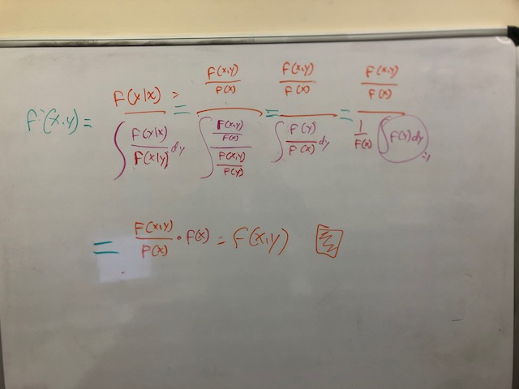

```{r setup, include=FALSE}
Sys.setenv(HTTP_PROXY = "c1proxy.frb.org:8080")
Sys.setenv(HTTPS_PROXY = "c1proxy.frb.org:8080")
Sys.setenv(SPARK_HOME = "/usr/hdp/current/spark2-client")
Sys.setenv(SPARK_CONF_DIR= "/usr/hdp/current/spark2-client/conf/")

library(knitr)
library(rmarkdown)
library(expm)
library(rmutil)
library(matlib)
library(mnormt)

knitr::opts_chunk$set(echo = TRUE)
```

## Problem 1 

### (a)
Write a Gibbs sampler using the conditional distributions provided in Example 7.4. Run your R code for p=5 and $\rho = 0.25$. Verify that the marginals are all $N(,01)$
NOTE: Okay the 500 iterations just says system.time = 0 so I'm bumping it up to 50000 so I can compare.
```{r}
# Set up the parameters as in the question
  Nsim <- 50000
  p <- 5
  r <- 0.25

# Get the starting distributions 
  
  ## X0 should have p samples from the normal distribution
    X0 <- rnorm(p)
  ## The first x should have the save values as X0  
    XI <- X0
    
# Run the sampling 
  system.time( for (t in 2:Nsim){
     for (i in 1:p) {
      # Get X bar from the pervious iteration 
        avgx <- sum(XI[i-1])/(p-1)
      # Gather the current X with the formuala from 7.4
        XI[i] <- rnorm(1,(p-1)*r*avgx/(1+(p-2)*r),sqrt((1+(p-2)*r-(p-1)*r^2)/(1+(p-2)*r)))
     }
     X0 <- rbind(X0,XI)
   })


# Plots
  par(mfrow=c(1,3))
  for (i in 1:p){
    hist(X0[,i],freq=FALSE)
    curve(dnorm(x),add=TRUE)
  }
    
```

### (b)
Compare your algorithm using 500 Iterations with rnorm described in 2.2.1 in terms of execution time. 
Okay the 500 iterations just says system.time = 0 so I'm bumping it up to 50000. It is very clearly way faster. 

```{r}
## I basically just used  the example from 
  # https://www.rdocumentation.org/packages/lgarch/versions/0.6-2/topics/rmnorm
system.time(
x <- rmnorm(n=Nsim,varcov = diag(c(1,1,1,1,1)))
)
```


## Problem 2
My latex is such that I'm not sure I could make this proof easy to read (too many fractions of fractions). So I've taken a picture of my proof on my white board. I hope that will suffice. 





